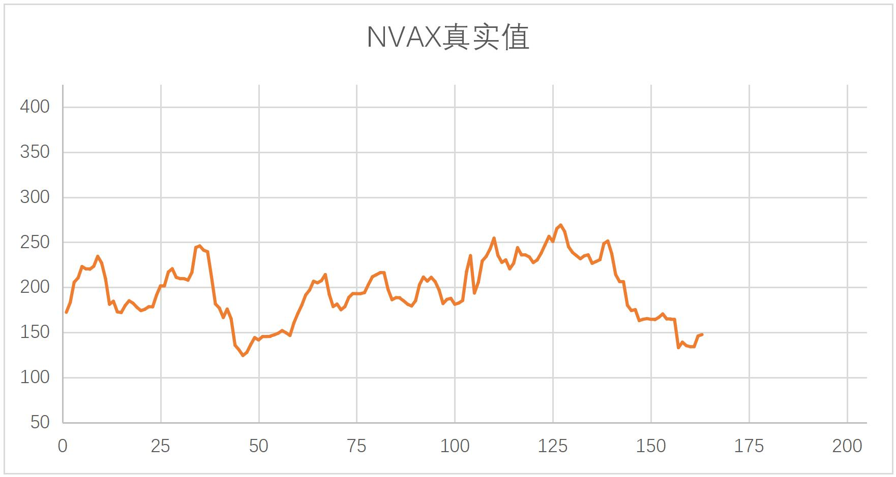
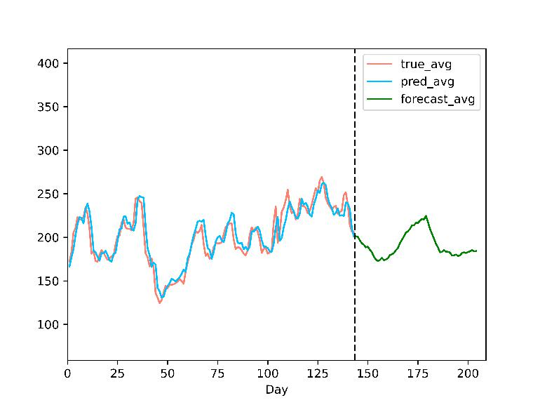
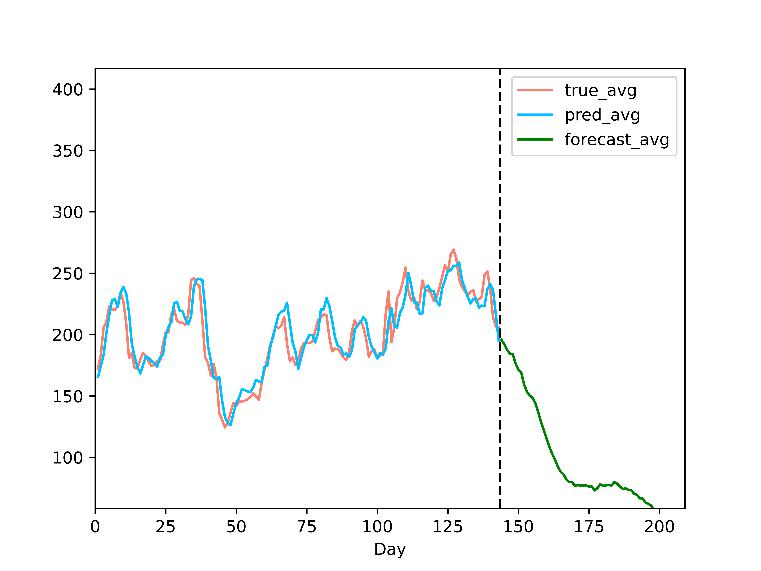
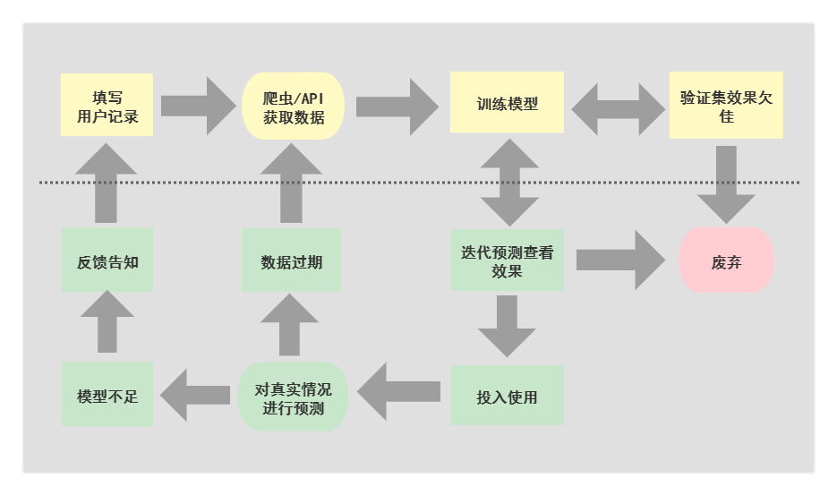

[English](README.md) | [中文](README_zh.md)

## Introduction

This project was completed during our freshman year at HITSZ (2020-2021), focusing on the topic "Stock Prediction and Analysis based on Machine Learning." It served as our first exploration into deep learning and the complete workflow of an engineering project, achieving its initial goals in both aspects.

The project is divided into two main parts: the implementation of the graphical user interface (GUI) and the development of various machine learning models. The Config class serves as the bridge between these two components, encapsulating all the necessary parameters for the GUI to interact with the models. We learned this encapsulation strategy from a reference project on GitHub [https://github.com/hichenway/stock_predict_with_LSTM/blob/master/main.py](https://github.com/hichenway/stock_predict_with_LSTM/blob/master/main.py).

## Project Capabilities

We believe that with proper training, our models can effectively capture most stock trends. Even if they occasionally predict the opposite trend for a few stocks, we think this issue can be resolved with a more detailed analysis model.

Using a single neural network to predict complex stock prices based on historical data is feasible. This suggests that despite various influencing factors, stocks exhibit certain patterns over time. The direction of data normalization significantly impacts how the model learns. Our unconventional normalization approach avoids potential data leakage and seamlessly transitions to iterative prediction data processing.

Combining iterative prediction (using previously predicted prices to make new predictions) with follow-up prediction (using true historical prices to make predictions) can help eliminate unsuitable models to some extent. A common issue in follow-up prediction is that models may simply use the previous day's price as the current day's output, causing a lag. Iterative prediction helps determine if the trend learned by the model is correct.

## Project Overview

### Project Results

The images below show the results for NVAX stock (more results can be found in the `assets` folder):

  
  

### Project Structure

The GUI framework is built using the wxPython library, which serves as the main module of the project, invoking and organizing other components. For data acquisition, we used the official API for efficient handling of stock data updates, resorting to web scraping only when searching for unknown stock abbreviations. This approach improves efficiency compared to traditional web scraping methods.

Data processing and analysis directly affect model learning outcomes. We observed common issues such as underfitting and overfitting, which required parameter tuning and optimization techniques. We analyzed the reliability of the results and developed highly reliable models, investing more effort into understanding intriguing phenomena.

### Limitations

1. For individual developers, there is limited support for the GUI interface, relying mainly on the source code and console.
2. The data source requires a stable internet connection, whether using the API or the web scraper.
3. Analyzing model details remains challenging. While standard image processing can be explained using methods like Saliency Maps, evaluating stock prediction outcomes is more difficult.
4. The originally planned classification model was abandoned due to concerns that arbitrary classification of rises and falls might lead to model learning failures. This issue is still under investigation.

### References

[1] 7forz. 2019. Predicting time series using LSTM. [https://www.7forz.com/3319/](https://www.7forz.com/3319/).  
[2] Jimmy Lei Ba, Jamie Ryan Kiros, and Geoffrey E. Hinton. 2016. Layer normalization.  
[3] Sergey Ioffe and Christian Szegedy. 2015. Batch normalization: Accelerating deep network training by reducing internal covariate shift.  
[4] Yuxin Wu and Kaiming He. 2018. Group normalization.  
[5] Zhang Feng. 2015. Understanding HMM (Hidden Markov Model). [https://www.cnblogs.com/skyme/p/4651331.html](https://www.cnblogs.com/skyme/p/4651331.html).  
[6] Programmer One One Dis. 2020. Time series prediction with Python Part Four: Stationary/Non-stationary time series. [https://cloud.tencent.com/developer/article/1638198](https://cloud.tencent.com/developer/article/1638198).  
[7] Fat House_Sean. 2018. Stock prediction using LSTM. [https://blog.csdn.net/a19990412/article/details/85139058](https://blog.csdn.net/a19990412/article/details/85139058).